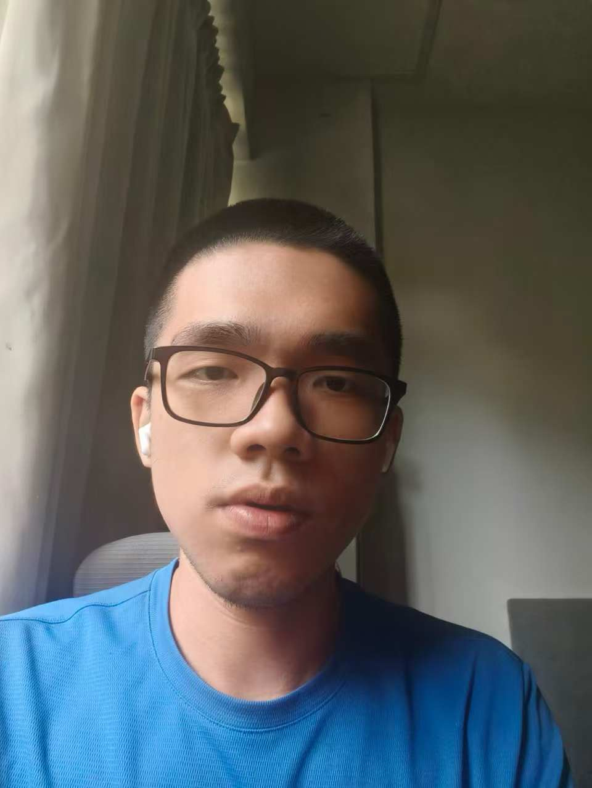
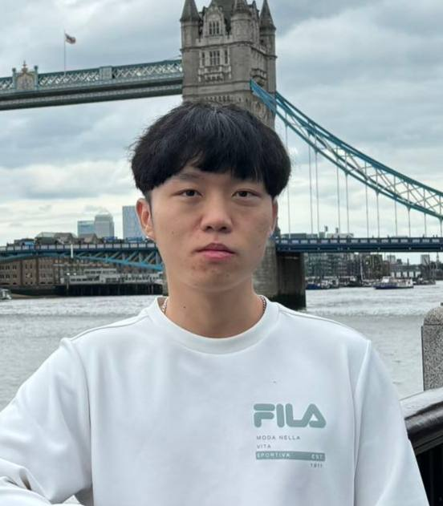
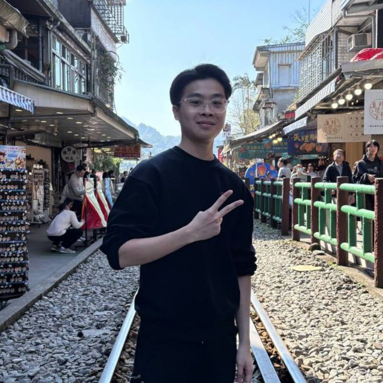

# About Us

We are a team based in the [School of Computing, National University of Singapore](http://www.comp.nus.edu.sg).

You can reach us at the email `seer[at]comp.nus.edu.sg`

## Project team

### Baizhou

[[github](https://github.com/windofbitter)]

* Role: Documentation, ChatGpt Expert, Claude Expert, Deepseek Expert, Gemini Expert, Grok3 Expert

### Xiao Ao

[[homepage](http://www.comp.nus.edu.sg/~damithch)]
[[github](https://github.com/johndoehttps://github.com/xa0412/tp)]
[[portfolio](team/johndoe.md)]

* Role: Deliverables and deadlines

### Jane Doe

[[github](http://github.com/johndoe)]
[[portfolio](team/johndoe.md)]

* Role: Team Lead
* Responsibilities: UI

### Tiew Jia Liang

[[github](http://github.com/TiewJiaLiang)] [[portfolio](team/johndoe.md)]

* Role: Scheduling and Tracking 
* Responsibilities: In charge of defining, assigning and tracking project tasks

### Jean Doe

[[github](http://github.com/johndoe)]
[[portfolio](team/johndoe.md)]

* Role: Developer
* Responsibilities: Dev Ops + Threading

### Xavier Lee

[[github](https://github.com/Xavierlhm)]
[[portfolio](team/johndoe.md)]

* Role and Responsibility: Code Quality
