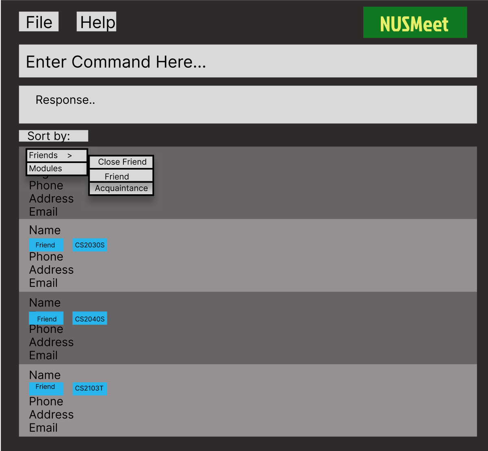
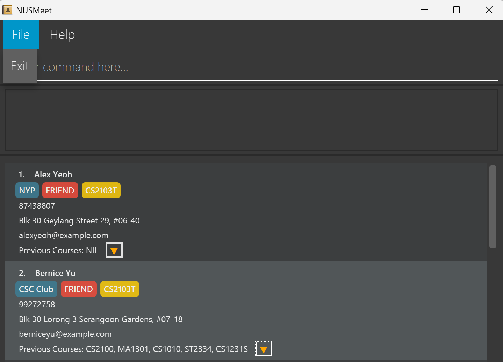
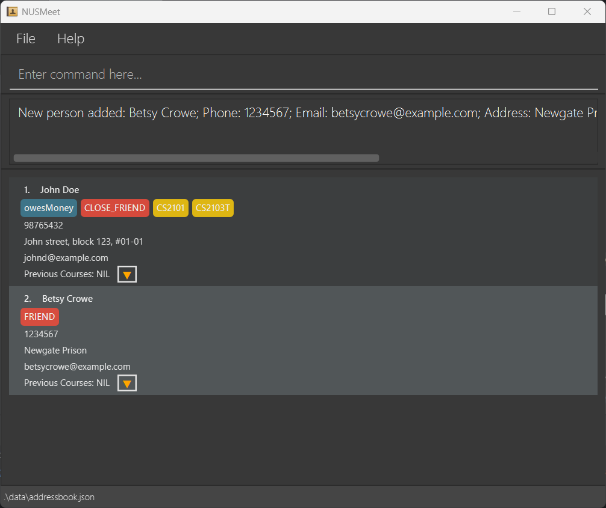
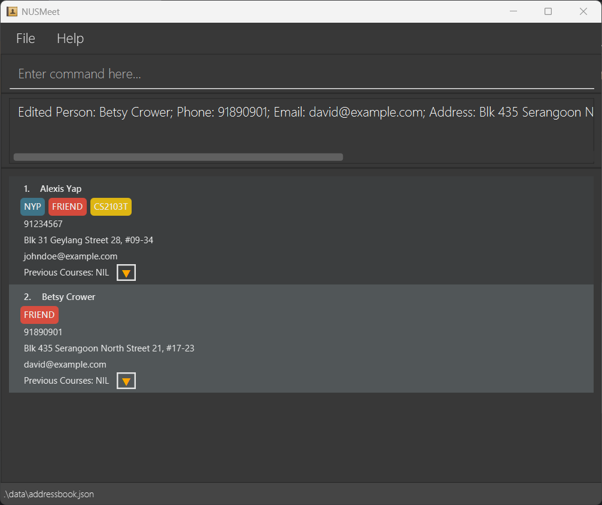
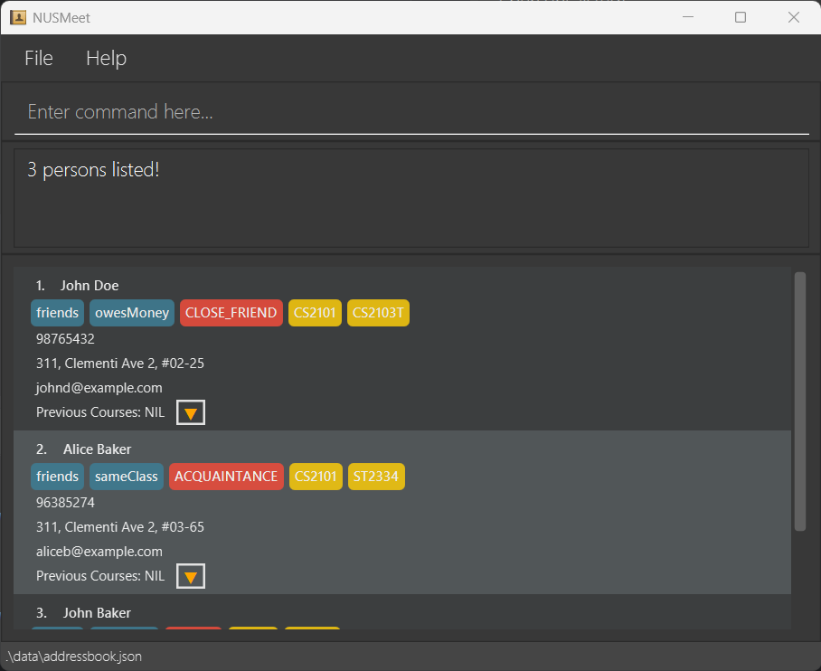
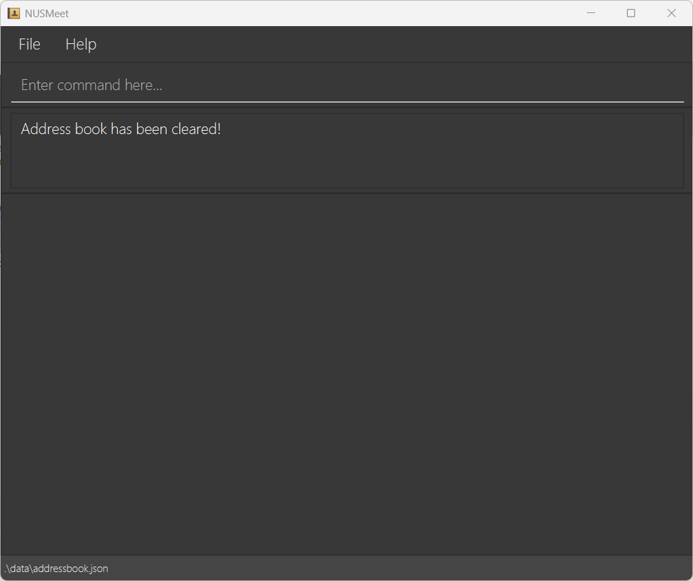

# Table of Contents

- [Quick Start](#-quick-start)
- [UI Overview](#-ui-overview)
- [Command Overview](#-command-overview)
- [Features](#-features)
  - [Viewing Help](#1-viewing-help-help)
  - [Adding a Friend](#2-adding-a-friend-add)
  - [Listing All Friends](#3-listing-all-friends-list)
  - [Editing a Friend](#4-editing-a-friend-edit)
  - [Finding Friends](#5-finding-friends-find)
  - [Deleting a Friend](#6-deleting-a-friend-delete)
  - [Clearing All Entries](#7-clearing-all-entries-clear)
  - [Exiting the Program](#8-exiting-the-program-exit)
  - [Saving Your Data](#9-saving-your-data)
  - [Editing the Data File](#10-editing-the-data-file)
  - [Automatic Courses Archival](#11-automatic-courses-archival)
  - [Features Coming Soon](#12-features-coming-soon)
- [Tips](#tips)
- [FAQ](#faq)
- [Known Issues](#known-issues)
- [Glossary](#glossary)

---

# NUSMeet User Guide

**NUSMeet** is your go-to **Command Line Interface (CLI)** application for **keeping track** of your friends and schoolmates at NUS. No more scrambling to remember who's taking the same module as you — just **_tag_**, and **_find_** the right people to study with in seconds.

Designed for NUS students (by NUS students!), NUSMeet is perfect for those with an already established network of contacts who want to meet others to discuss schoolwork and prefer the speed of typing 🧑‍💻 over clicking 🖱️. NUSMeet makes **organizing your contacts effortless** so you can focus on what really matters — acing your studies with the right people by your side! 👫👫

---

## 🛠️ Quick start

Follow these steps to install and run NUSMeet on your computer!

1. Before running NUSMeet, ensure that you have **Java `17` or above** installed in your Computer. 

   - **Windows users:** Install the precise JDK version prescribed [here](https://se-education.org/guides/tutorials/javaInstallationWindows.html).
   - **Mac users:** Install the precise JDK version prescribed [here](https://se-education.org/guides/tutorials/javaInstallationMac.html).
   - **Linux users:** Install the precise JDK version prescribed [here](https://se-education.org/guides/tutorials/javaInstallationLinux.html).

2. Download the latest `.jar` file [here](https://github.com/AY2425S2-CS2103T-T13-3/tp/releases).

3. Move the downloaded file to a folder of your choice to be used as the _home folder_ for your NUSMeet application.

4. Open a command terminal and navigate to the folder where you placed the `.jar` file using `cd /path/to/your/folder`. Type the `java -jar NUSMeet.jar` command to run the application. 
   A **Graphical User Interface (GUI)** similar to the one shown below should appear in a few seconds. 
   .

5. Type the [command](#-command-overview) in the command box and press Enter to execute it. e.g. typing **`help`** and pressing Enter will open the help window. 

6. Refer to the [Features](#-features) below for details of each command.

---

## 💻 UI Overview

#### 1. File Tab

The File tab allows you to exit the application by clicking on "Exit" instead of typing the command manually.

#### 2. Help Tab

The Help tab opens a pop-up displaying a message explaining how to access the help page. It can also be accessed by pressing F1 on your keyboard.

#### 3. Person Card

The Person Card displays the following user information:

- Name.
- Tags.
  -  Normal Tag (Blue) : Provides additional meaningful information about your friend, such as skill level, hobbies, etc.
  -  Friendship Tag (Red) : Represents the level of closeness to your friend.
  - Courses Tag (Yellow) : Indicates the current courses your friend is enrolled in.
- Phone Number.
- Address.
- Email.
- Previous Courses.
  - No Previous Courses: Displays "NIL".
  - Has Previous Courses: Displays the 5 most recently **added** courses.
  - Expanded Arrow: Display all previous courses throughout all semesters when clicked.

---

## ⌨️ Command Overview

Now that you have set up NUSMeet, let's explore the key commands you can use!

| Action                                 | Format, Examples                                                                                                                                                                                                   |
| -------------------------------------- | ------------------------------------------------------------------------------------------------------------------------------------------------------------------------------------------------------------------ |
| **[Add](#2-adding-a-friend-add)**      | `add n/NAME p/PHONE_NUMBER e/EMAIL a/ADDRESS f/FRIENDSHIP_LEVEL [c/COURSE]…​ [o/PREVIOUS_COURSE]…​ [t/TAG]…​ `   e.g., `add n/James Ho p/98105221 e/jamesho@example.com a/Blk 123 Clementi Rd, #12-27 f/FRIEND` |
| **[Clear](#7-clearing-all-entries-clear)** | `clear`                                                                                                                                                                                                            |
| **[Delete](#6-deleting-a-friend-delete)** | `delete INDEX`  e.g., `delete 3`                                                                                                                                                                                |
| **[Edit](#4-editing-a-friend-edit)**   | `edit INDEX [n/NAME] [p/PHONE] [e/EMAIL] [a/ADDRESS] [c/COURSE]…​ [f/FRIENDSHIP_LEVEL] [t/TAG]…​`  e.g.,`edit 2 n/James Lee e/jameslee@example.com`                                                                   |
| **[Find](#5-finding-friends-find)**    | `find [n/KEYWORD [MORE_KEYWORDS]] [c/KEYWORD [MORE_KEYWORDS]]`  e.g., `find n/James Jake c/CS2101 ST2334`                                                                                                       |
| **[List](#3-listing-all-friends-list)** | `list`                                                                                                                                                                                                             |
| **[Help](#1-viewing-help-help)**       | `help`                                                                                                                                                                                                             |

<box type="info" seamless>

**Notes about the command format:** 

#### 1. Upper Case

- Words in `UPPER_CASE` are the parameters you should supply! 
  e.g. in `add n/NAME`, `NAME` is a parameter which can be used as `add n/John Doe`.

#### 2. Square Brackets `[ ]`

- Items in square brackets are _optional_. 
  e.g `n/NAME [t/TAG]` can be used as `n/John Doe t/NYP` or as `n/John Doe`.

#### 3. Triple Dots `…​`

- Items with `…`​ after them can be used _multiple times_ including zero times. 
  e.g. `[c/COURSE]…​` can be used as `c/CS2103T`, `c/CS2103T c/CS2101` or 0 times etc.

#### 4. Ordering

- Parameters can be in _any order_. 
  e.g. if the command specifies `n/NAME p/PHONE_NUMBER`, `p/PHONE_NUMBER n/NAME` is also acceptable.

#### 5. Parameters

- Extraneous parameters for commands that do not take in parameters (such as `help`, `list`, `exit` and `clear`) will be ignored. 
  e.g. if the command specifies `help 123`, it will be interpreted as `help`.

#### 6. PDF

- If you are using a PDF version of this document, be careful when copying and pasting commands that span multiple lines as space characters surrounding line-breaks may be omitted when copied over to the application.
  </box>

## 🚀 Features

### 1. Viewing help : `help`

Shows a message explaining how to access the help page.

Format: `help`

### 2. Adding a friend: `add`

Adds a friend to your contact book:

Format: `add n/NAME p/PHONE_NUMBER e/EMAIL a/ADDRESS f/FRIENDSHIP_LEVEL [c/COURSE]…​ [o/PREVIOUS_COURSE]…​ [t/TAG]…​`

<box type="tip" seamless>

**Note:**

- The Friendship_Level Tag can only be one of the following: `CLOSE_FRIEND`, `FRIEND`, `ACQUAINTANCE`.
- A friend can have any number of tags, courses & previous courses.
- If a course or previous course is duplicated, it will only be displayed once instead of as separate entries.
- Names should only be between 1 to 50 characters long and starting with alphabetical characters. It is able to contain spaces, 3 type of special character (. ' -) and it should not be blank.
- Phone numbers must start with "+" and contain only digits. It must be between 3 to 15 digits long and it does not need to be distinct.
- Emails must follow the format local-part@domain. It does not need to be distinct.
- Course & Previous Course names should be alphanumeric and follow a structured format: a department code (letters), followed by a course number (digits), with an optional single-letter suffix e.g., CS2030S or CFG1003.
- Normal tags should be alphanumeric and can be up to 50 characters long with spacing.
</box>

**Examples:**

- `add n/Alexis Yap p/97438807 e/alexis@example.com a/Blk 31 Geylang Street 28, #09-34 c/CS2103T o/CS2100 t/NYP f/FRIEND`.
- `add n/David e/david@example.com a/Blk 435 Serangoon North Street 21, #17-23 p/91890901 f/FRIEND`.

### 3. Listing all friends : `list`

Shows a list of all your friends in your contact book.

Format: `list`

### 4. Editing a friend : `edit`

Edits an existing friend's details in your contact book:

Format: `edit INDEX [n/NAME] [p/PHONE] [e/EMAIL] [a/ADDRESS] [c/COURSE]…​ [f/FRIENDSHIP_LEVEL] [t/TAG]…​`

- Edits the friend at the specified `INDEX`. The index refers to the index number **currently** shown in the displayed friend list. The index **must be a positive integer** 1, 2, 3, …​
- At least one of the optional fields must be provided.
- Providing new tags will update the friend's tags accordingly.
- You can remove all the friend's tags by typing `t/` without specifying any tags after it.

**Examples:**

- `edit 1 p/91234567 e/johndoe@example.com` Edits the phone number and email address of the 1st friend to be `91234567` and `johndoe@example.com` respectively.
- `edit 2 n/Betsy Crower` Edits the name of the 2nd friend to be `Betsy Crower`.

### 5. Finding friends: `find`

Finds friends who contain any of the given keywords or courses, including those who have the specified courses in their previous courses:

Format: `find [n/KEYWORD [MORE_KEYWORDS]] [c/KEYWORD [MORE_KEYWORDS]]`

- The search is case-insensitive, e.g., `hans` will match `Hans`.
- The order of the keywords does not matter, e.g., `Hans Bo` will match `Bo Hans`.
- At least one of the optional fields must be provided.
- The name (`n/`) or courses (`c/`) or both is searched.
- Only full words will be matched, e.g., `Han` will not match `Hans`, `2103` will not match `2103T`.
- Persons matching at least one keyword will be returned (i.e., `OR` search), e.g., `Hans Bo` will return `Hans Gruber`, `Bo Yang`.
- Searching by courses (`c/`) will also include friends who have the specified courses in their previous courses.

**Sorting Algorithm:**
When searching with course keywords, the results are sorted in the following priority order:
1. Friends with the most matching current courses (highest similarity with your search terms)
2. If current course matches are equal, then by the most matching previous courses
3. If both current and previous course matches are equal, then by friendship level (CLOSE_FRIEND > FRIEND > ACQUAINTANCE)

This sorting ensures that the most relevant contacts for your search terms appear at the top of the results.

**Examples:**

- `find n/John Baker` returns `John Doe` and `Alice Baker` and `John Baker`.
  
- `find c/CS2101` returns friends who are currently taking CS2101 as well as those who have taken CS2101 in the past.

### 6. Deleting a friend : `delete`

Deletes the specified friend from your contact book:

Format: `delete INDEX`

- Deletes the friend at the specified `INDEX`.
- The index refers to the index number shown in the displayed friend list.
- The index **must be a positive integer** 1, 2, 3, …​

**Examples:**

- `list` followed by `delete 2` deletes the 2nd friend in the address book.
- `find n/Betsy` followed by `delete 1` deletes the 1st friend in the results of the `find` command.

.

### 7. Clearing all entries : `clear`

Clears all entries from your contact book:

Format: `clear`

### 8. Exiting the program : `exit`

Exits the program:

Format: `exit`

### 9. Saving your data

NUSMeet automatically saves all changes to disk. There is no need to manually save your data.

### 10. Editing the data file

NUSMeet automatically stores your contact as a JSON file at `[JAR file location]/data/addressbook.json`.
You can manually edit this file.

**⚠️Caution:**

- If file format is **invalid**, NUSMeet will **discard** all data and start with an empty data file at the next run.
- Certain **incorrect** edits (e.g., invalid values, duplicate values). can cause **unexpected** behavior (e.g. error loading data file).
- Recommended to **backup** the file before making any changes.

### 11. Automatic Courses Archival

NUSMeet uses the system date to perform automatic courses archival at the end of each academic semester. When a new semester begins, any courses your friends were taking in the previous semester will be automatically moved to their "Previous Courses" section, and their current courses list will be cleared. This saves you time and effort as you no longer need to manually update each contact.

**Important notes:**
- The archival is based on your computer's system date and occurs when you start the application.
- You don't need to manually update each contact's courses - the system handles it for you!
- Make sure your computer's system date is accurate to ensure this feature works correctly.

### 12. Features Coming Soon!

- Finding friends using index number.
- Skill-Based Sorting & Searching.

---

## 📌 Tips

To make the most out of NUSMeet, here are some tips to help you organize, manage and navigate the application efficiently!

### 1. Personalize Your Tags

- Use meaningful and consistent tags to categorize your contacts.
- For example, you can include skill levels, hobbies to create more meaningful connections.

### 2. Keep your Contact Book updated

- Regularly update your contact book to reflect changes in friendships, courses and contact details.
- Keeping your contact book updated improves our searching algorithm, helping you find the best friend to discuss schoolwork with through accurate and up-to-date contact details.
- Remove outdated contacts to keep your contact book relevant and concise.

### 3. Be Specific & Detailed

- Provide clear and relevant details to improve searching and sorting.
  - Full Name - Helps distinguish contacts with similar names.
  - Friendship - Specify the closeness of friendships to enhance sorting accuracy.
  - Courses - Ensure correct course codes (e.g., CS1231 vs. CS1231S) to find the right course mates.

### 4. Ensure Accuracy

- Keep your system time is accurate to ensure automatic course archival functions properly.
- Double-check the accuracy of names, tags, courses, phone numbers, emails, and addresses to ensure precise searches and avoid confusion.

### 5. Utilize Search function

- Use the find command to quickly locate contacts based on name or course.
- Be precise when entering names and course codes for the best search results.

---

## 📝 FAQ

**Q**: How do I transfer my data to another Computer? 
**A**: Install the app in the other computer and overwrite the empty data file it creates with the file that contains the data of your previous NUSMeet home folder.

---

## ❗Known issues

1. **When using multiple screens**, if you move the application to a secondary screen, and later switch to using only the primary screen, the GUI will open off-screen.   **Solution:** Delete the `preferences.json` file created by the application before running the application again.
2. **If you minimize the Help Window** and then run the `help` command (or use the `Help` menu, or the keyboard shortcut `F1`) again, the original Help Window will remain minimized, and no new Help Window will appear.   **Solution:** Manually restore the minimized Help Window.

---

## 📖 Glossary

| Terms                | Definitions                                                                                    |
| -------------------- | ---------------------------------------------------------------------------------------------- |
| **CLI (Command Line Interface)** | A text-based interface where users interact with an application. |
| **Command Terminal** | A console application where users enter commands. |
| **Java**             | A programming language required to run an application. |
| **JDK (Java Development Kit)**   | A software package needed to run Java applications. |
| **JSON (JavaScript Object Notation)** | A lightweight data format used to store and exchange data. |
| **GUI (Graphical User Interface)** | A visual interface that allows users to interact with an application. |
